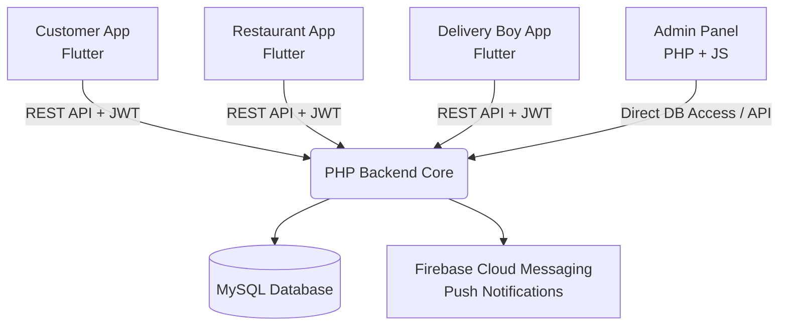

<div align="center">
  
# 🍔 FoodDash - Comprehensive Online Food Delivery Platform

[](https://flutter.dev/)
[](https://php.net/)
[](https://mysql.com/)
[](https://opensource.org/licenses/MIT)

**A complete, end-to-end food delivery solution featuring three dedicated mobile apps (Customer, Restaurant, Delivery Boy) built with Flutter and a powerful Admin Portal powered by PHP.**

---

</div>

## 📌 Table of Contents

- [Overview](#-overview)
- [System Architecture](#-system-architecture)
- [Applications & Tech Stack](#-applications--tech-stack)
- [Key Features](#-key-features)
  - [Customer App](#1-customer-app)
  - [Restaurant App](#2-restaurant-app)
  - [Delivery Boy App](#3-delivery-boy-app)
  - [Admin Panel](#4-admin-panel)
- [Project Structure](#-project-structure)
- [Screenshots](#-screenshots)
- [Quick Start Guide](#-quick-start-guide)
  - [Prerequisites](#prerequisites)
  - [1. Database Configuration](#1-database-configuration)
  - [2. Backend Setup](#2-backend-setup)
  - [3. Admin Panel Setup](#3-admin-panel-setup)
  - [4. Running the Flutter Apps](#4-running-the-flutter-apps)
- [API Documentation Overview](#-api-documentation-overview)
- [Security & Authentication](#-security--authentication)
- [Contributing](#-contributing)
- [License](#-license)

---

## 🌟 Overview

**FoodDash** is a highly scalable, robust online food ordering and delivery system. It bridges the gap between hungry customers, local restaurants, and delivery personnel through seamless real-time syncing, OTP-verified deliveries, and an intuitive UI. 

Whether you're looking to start a food delivery startup or study a production-grade multi-app architecture, FoodDash covers all the bases.

---

## 🏗️ System Architecture



---

## 💻 Applications & Tech Stack

| Component | Technology | Theme / Role | Description |
| :--- | :--- | :--- | :--- |
| **Customer App** | Flutter / Dart | Orange `#FF6B35` | Browse restaurants, add to cart, apply coupons, real-time tracking |
| **Restaurant App** | Flutter / Dart | Green `#059669` | Order management, menu CRUD, earnings tracking |
| **Delivery Boy App**| Flutter / Dart | Indigo `#4F46E5` | Accept/Reject deliveries, maps routing, OTP verification |
| **Backend API** | PHP (Core) | Headless | Scalable RESTful API, Token Generation, Data Processing |
| **Admin Panel** | PHP, Bootstrap 5 | Admin Dashboard | Complete site administration, user management, and analytics |

---

## ✨ Key Features

### 1. Customer App
- **Smart Discovery:** Powerful search and filters by cuisine, ratings, and veg/non-veg preferences.
- **Dynamic Cart & Checkout:** Easy item customization, coupon code applied dynamically, and seamless checkout.
- **Live Tracking:** Real-time order status tracking from preparation to final delivery.
- **In-App Chat:** Communicate directly with the assigned delivery driver.
- **Profile & Address:** Easy management of multiple delivery addresses.

### 2. Restaurant App
- **Live Order Dashboard:** Split-view for Pending, Preparing, Ready, and Delivered orders.
- **Menu Management:** Complete control over categories, food items, prices, and stock visibility.
- **Analytics & Earnings:** Interactive charts displaying daily and monthly revenue.
- **Order Lifecycle:** Accept or reject incoming orders instantly with push notifications.

### 3. Delivery Boy App
- **Online/Offline Switch:** Drivers can toggle their availability on duty.
- **Smart Request System:** Instant alerts for nearby delivery assignments.
- **OTP Verification:** Secure hand-offs using a mandatory OTP provided by the customer.
- **Wallet & Earnings:** Track trip earnings and delivery history transparently.

### 4. Admin Panel
- **Master Dashboard:** Bird's-eye view of gross sales, active restaurants, and system health.
- **User Management:** Ban, approve, or suspend users (Customers, Restaurants, Drivers).
- **Coupon Engine:** Generate and manage discount codes, setting limits and expiries.
- **Reports Generation:** Downloadable analytical reports for performance auditing.

---

## 🗂️ Project Structure

```text
Online_Food_Delivery_Project/
├── backend/                  # Centralized REST API endpoints
│   ├── index.php             # Core API Router
│   ├── controllers/          # Business logic handlers
│   └── helpers/              # Database, JWT, and Response utilities
├── admin_panel/              # Web-based Admin portal UI
├── customer_app/             # Flutter Mobile App for Users
├── restaurant_app/           # Flutter Mobile App for Restaurant Owners
├── delivery_boy_app/         # Flutter Mobile App for Riders
└── docs/                     # Database files, schemas, and API docs
```

---

## 📱 Screenshots

> **Note:** Add visual assets of your applications here. Create an `assets` folder in your repository and link your screenshots below.

<div align="center">
  
  
  
  <br/>
  <i>(Replace placeholders with actual app screenshots)</i>
</div>

---

## 🚀 Quick Start Guide

### Prerequisites
- **PHP 8.0+** installed
- **MySQL 5.7+** installed and running
- **Flutter SDK 3.0+**
- (Optional) **Firebase Configuration** for enabling push notifications

### 1. Database Configuration
Create a new database (e.g., `food_delivery`) and import the provided schema:
```bash
mysql -u root -p food_delivery < docs/database.sql
```
*(If `database.sql` is not found, use `backend/database_final_release.sql`)*

### 2. Backend Setup
Navigate to the backend directory and set up the environment variables:
```bash
cd backend
cp .env.example .env
```
Edit the `.env` file to match your database credentials and set a strong JWT secret. Next, run the local PHP server:
```bash
php -S localhost:8000
```
Your API will be live at `http://localhost:8000`.

### 3. Admin Panel Setup
Navigate to the Admin Panel directory:
```bash
cd admin_panel
```
Edit `config.php` with your database credentials. Serve via Apache/Nginx or run a local server:
```bash
php -S localhost:8080
```
Access the admin portal at `http://localhost:8080`.

### 4. Running the Flutter Apps
For each mobile app (`customer_app`, `restaurant_app`, `delivery_boy_app`), update the Base API URL in their respective network configuration files (e.g., `lib/config/api_config.dart`) to point to your backend IP (use your machine's local IP address, not `localhost` for testing on real devices/emulators).

Then, fetch dependencies and run:
```bash
cd customer_app
flutter pub get
flutter run
```

---

## 📡 API Documentation Overview

The PHP backend handles over **60+ secure endpoints**. All private endpoints require a Bearer JWT Token in the Authorization header.

| Method | Endpoint | Auth | Description |
| :--- | :--- | :---: | :--- |
| **POST** | `/api/register` | No | New user registration |
| **POST** | `/api/login` | No | Authentication and Token generation |
| **GET** | `/api/customer/home` | Yes | Retrieves banner, categories, and top restaurants |
| **POST** | `/api/orders/place` | Yes | Place a new food order |
| **POST** | `/api/restaurant/orders/{id}/accept` | Yes | Restaurant accepts an order |
| **POST** | `/api/delivery/orders/{id}/verify-otp`| Yes | Driver verifies delivery via OTP |

*(Check `backend/index.php` for complete endpoint mapping.)*

---

## 🛡️ Security & Authentication

- All user passwords are encrypted using **bcrypt**.
- Authentication is strictly managed via **JWT (JSON Web Tokens)**.
- Stringent role-based access control protecting API boundaries (Roles: `admin`, `customer`, `restaurant`, `delivery_boy`).
- Backend implements basic protections against SQL Injection using prepared statements.

---

## 🤝 Contributing

Contributions, issues, and feature requests are welcome! 
Feel free to check [issues page](https://github.com/Saad-sema/Online_Food_Delivery_Project/issues) if you want to contribute.

1. Fork the Project
2. Create your Feature Branch (`git checkout -b feature/AmazingFeature`)
3. Commit your Changes (`git commit -m 'Add some AmazingFeature'`)
4. Push to the Branch (`git push origin feature/AmazingFeature`)
5. Open a Pull Request

---

## 📄 License

This project is open-sourced for educational and development purposes.

---

<div align="center">
  <b>Built with ❤️ by SaaS/Flutter Developers.</b>
</div>
